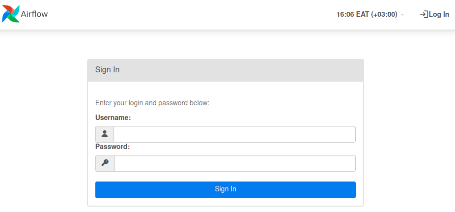
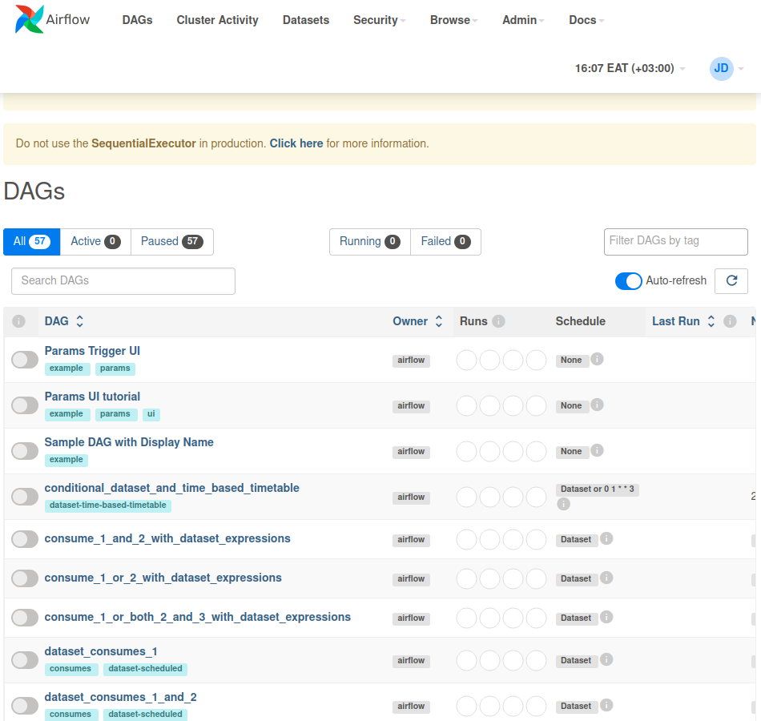
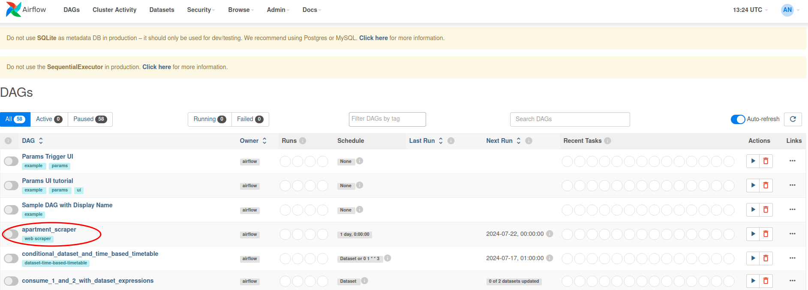
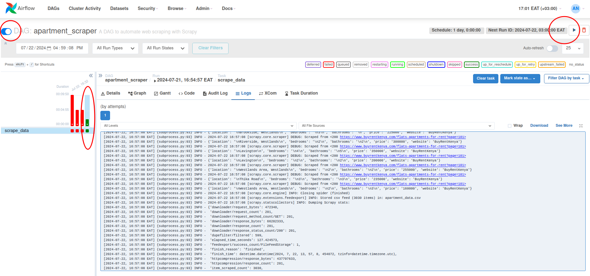

# Simple Airflow Automation
This is a simple automation to automate web scraping using [Apache Airflow](https://airflow.apache.org).

## Table of Contents
- [Setup](#setup)
    - [With Docker](#with-docker)
    - [Without Docker](#without-docker)
- [Running the DAG](#running-the-dag)

## Setup
### With Docker
This is the preferred way to run tasks in Airflow.
[WIP]

### Without Docker
Clone the repo:
```bash
git clone https://github.com/data-science-254/simple-airflow-automation.git
```

Change into the project's directory:
```bash
cd simple-airflow-automation
```

Install requirements:
1. Create a virtual environment using `python3 -m venv .venv`.
2. Activate the virtual environment using `source .venv/bin/activate`.
3. Install dependencies using `pip install -r requirements.txt`.

Setup Airflow:
1. Initialize the Airflow database using `airflow db migrate`.
    - This creates an `airflow` folder in your home directory with an `airflow.db` file.
2. Create an example admin user using `airflow users create --username admin --firstname John --lastname Doe --email 0p7sJ@example.com --role Admin --password admin`
3. Run the scheduler using `airflow scheduler`.
4. Run the webserver in another terminal using `airflow webserver`.

You should now be able to access the webserver at `http://localhost:8080`. Login with the admin user which is `admin` and the password `admin` as of now.



After logging in, you should be able to see the dashboard which has example tasks/dags.



Now that that's done, let's paste our example task/dag into the Airflow home folder.
Run the following commands:
```bash
# Make the dag folder to hold custom made dags
cd ~/airflow && mkdir dags
```
Open a terminal once again where the project was cloned and run:

```bash
# Copy our dag file into the dags folder in our home directory
cp src/simple_airflow_automation/dags/apartment_scraper_dag.py ~/airflow/dags
```

With this we're 90% done!

Lastly, we restart the scheduler and webserver to see if our dag file appears in the dashboard.    
Go to terminals where the scheduler and webserver are running and shut them down by pressing Ctrl+C.    
Rerun the scheduler and webserver using `airflow scheduler` and `airflow webserver` respectively.

With this, our dag file should be available in the dashboard:




## Running the DAG
We can start the dag from the UI by first activating it in the UI and then running it by clicking the play button. If the dag successfully runs we'll see a dark green bar on the left side of the UI.



